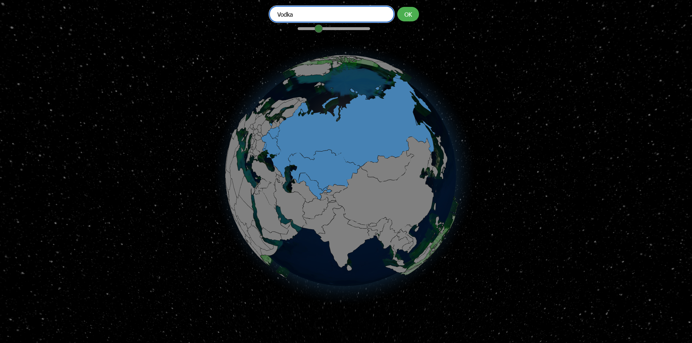
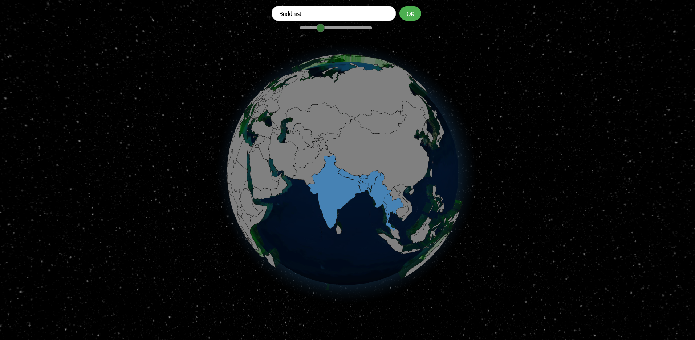

# Globe Visualization Project

## Overview

The Globe Visualization Project is an interactive web application that visualizes countries on a 3D globe. Users can search for countries using keywords and specify the number of related countries to highlight using a slider. The application then queries a Weaviate vector database to retrieve and highlight the most relevant countries based on the search input.

## Features

- **3D Globe Visualization:** Interactive globe where countries are highlighted based on search results.
- **Search Functionality:** Users can input keywords to search for related countries.
- **Adjustable Number of Results:** Slider to select the number of related countries to display.
- **Hover Information:** Displays the name of the country when hovered over.
- **Automatic Rotation:** The globe rotates automatically for better visualization.

## How It Works

### Frontend

- The frontend is built using HTML, CSS, and JavaScript.
- The `Globe.gl` library is used to render the 3D globe.
- Users can enter a search term in the search bar and use the slider to specify the number of results.
- The search term and number of results are sent to a Flask backend via a POST request.

### Backend

- The backend is built using Flask and serves as an API to handle search requests.
- The backend queries a Weaviate vector database to retrieve related countries based on the search term and number of results.
- The backend returns the related countries to the frontend, which then highlights these countries on the globe.

### Vector Search

- The Weaviate vector database is used to store and query country data.
- Each country is represented as a vector, and the search functionality uses vector similarity to find related countries.

## Screenshots

### Initial View


### Search Result


## Installation

1. Clone the repository:
   ```sh
   git clone https://github.com/yourusername/globe-visualization.git

2. Navigate to the project directory:
   ```sh
   cd globe-visualization

3. Set up virtual environment and run pyproject.toml file (ensure virtual environment is activated)
   ```sh 
   pip install -e .

4. **Create a `.env` file in the src directory adding the appropriate keys:**
    ```env
    WEAVIATE_CLUSTER_URL= https://globe-sandbox-3zfm9p88.weaviate.network
    WEAVIATE_API_KEY= your_weaviate_api_key
    OPENAI_API_KEY= your open_ai key
    ```

5. Navigate to the app.py flask backend server and active it by running
   ```sh
   python app.py

6. Start a localhost and open index.html to view the frontend


## Usage

- Enter a keyword in the search bar.
- Adjust the slider to specify the number of related countries to display.
- Click the "OK" button to execute the search.
- The related countries will be highlighted on the globe in steel blue, while other countries will be grey.

## Code Structure

- `index.html`: The main HTML file for the frontend.
- `styles.css`: The CSS file for styling the frontend.
- `app.py`: The Flask backend file.
- `pyproject.toml`: The list of Python dependencies.

## Dependencies

- Flask
- Weaviate
- Globe.gl
- d3.js
- Three.js

## License

This project is licensed under the MIT License.

## Contact

For any questions or suggestions, please contact [samir.c.asghar@gmail.com].